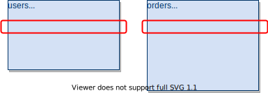
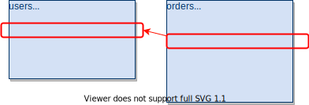

# テーブル作成の応用設定

テーブル間の関連付けやオプション設定などの詳細なテーブル設定方法を学習します。


## 制約とは

SQLにおける制約とは、操作上の禁止事項や制限などを指します。

1. キーに対する制約  
  プライマリーキーなどのキーに対する制約が設定されている
2. `Null`や `Not Null`に対する制約  
  `Null`や`Not Null`の設定に応じて、項目に対する入力内容に対して制約が変更されます。
3. デフォルト値に対する制約  
  デフォルトで値を設定するといったオプション設定をすることができ、それに応じて入力制約が追加されます。

## キーとは

|キーの種類|説明|
|---|:---|
|プライマリーキー|テーブルに登録するデータの中で該当レコードを一意に特定することができる列のこと<br>テーブル内に1つだけ設定できる|
|外部キー|関連したテーブル館を結ぶために設定する列のことで、データの関連性と整合性を保証するために利用される|
|ユニークキー|重複した値を許さない列のこと<br>テーブル内で複数設定可能|


## プライマリーキーの設定

テーブルを作成する際のプライマリーキーの設定と役割について確認します。





### プライマリーキーの役割

- インデックスと呼ばれる情報が自動的に作成されるためテーブルを早く検索することができる
- 一意にデータを特定して、重複がないようにテーブルデータの整合性を保証する
- 他のテーブル位置いて、外部キーとして設定してもらうことで、そのテーブルとの関連性を設定する

### プライマリーキーの制約

- `PRIMARY KEY` 制約を設定したカラムは重複した値を格納することができない。
- 必須値になるため`NULL`値の登録ができず、自動で採番される。

### プライマリーキーの設定


#### オートインクリメント指定せず、プライマリーキーの設定

プライマリーキーを設定する際に、オートインクリメントを設定していない場合は、プライマリーキーを指定してユニークな値を指定する必要がある。


```sql
CREATE DATABASE orders;

show databases;

use orders;

CREATE TABLE users(
  id int(5),
    name varchar(255),
    email varchar(255),
    age int(3),
    primary key(id)
);

show tables;

desc users;

INSERT INTO users VALUE( 1, 'Smith', 'smith@hotmail.com', 58);

SELECT * FROM users;

INSERT INTO users(name, email, age) VALUE('Akira', 'akira@hotmail.com', 24);

SELECT * FROM users;

INSERT INTO users(name, email, ase) VALUE('Liliy', 'liliy@hotmail.com', 21);


SELECT * FROM users;

```

```
ERROR 1364 (HY000): Field 'id' doesn't have a default value
```

```
# id  name  email age
0 Akira akira@hotmail.com 24
1 Smith smith@hotmail.com 58

```

#### オートインクリメント指定して、プライマリーキーの設定

```sql
DROP TABLE users;

show tables;

CREATE TABLE users(
  id int(5) primary key auto_increment,
    name varchar(255),
    email varchar(255),
    age int(3)
);

show tables;

desc users;

INSERT INTO users VALUE( 1, 'Smith', 'smith@hotmail.com', 58);

SELECT * FROM users;

INSERT INTO users(name, email, age) VALUE('Akira', 'akira@hotmail.com', 24);

SELECT * FROM users;

INSERT INTO users(name, email, age) VALUE('Liliy', 'liliy@hotmail.com', 21);

SELECT * FROM users;

```
```
# id	name	email	age
1	Smith	smith@hotmail.com	58
2	akira	akira@hotmail.com	21
3	Lily	lily@hotmail.com	24


```

```ddl
CREATE TABLE `users` (
  `id` int(5) NOT NULL AUTO_INCREMENT,
  `name` varchar(255) DEFAULT NULL,
  `email` varchar(255) DEFAULT NULL,
  `age` int(3) DEFAULT NULL,
  PRIMARY KEY (`id`)
) ENGINE=InnoDB AUTO_INCREMENT=4 DEFAULT CHARSET=latin1

```

## 外部キーの設定

テーブルを作成する際の外部キーの設定と役割について確認します。




### 外部キー制約（DELETE）

|||
|---|:---|
|ON DELETE CASCADE|親テーブル／親レコードを削除するとき、子テーブルの参照しているデータも削除される|
|ON DELETE RESTRICT|親テーブル／親レコードを削除するとき、エラーとなって削除できないようにする|
|ON DELETE SET NULL|親テーブル／親レコードを削除するとき、子テーブルの参照しているデータがNULLとなる|


### 実例

#### 外部キーを設定して、テーブルを作成

```mysql
mysql> CREATE TABLE orders(
    ->   id INT(10),
    ->     user_id INT,
    ->     amount INT(20),
    ->     price INT(20),
    ->     PRIMARY KEY(id),
    ->     FOREIGN KEY (user_id) REFERENCES users(id) ON DELETE CASCADE
    -> );
Query OK, 0 rows affected (0.03 sec)

mysql> show tables;
+------------------+
| Tables_in_orders |
+------------------+
| orders           |
| users            |
+------------------+
2 rows in set (0.01 sec)

mysql> desc orders;
+---------+---------+------+-----+---------+-------+
| Field   | Type    | Null | Key | Default | Extra |
+---------+---------+------+-----+---------+-------+
| id      | int(10) | NO   | PRI | NULL    |       |
| user_id | int(11) | YES  | MUL | NULL    |       |
| amount  | int(20) | YES  |     | NULL    |       |
| price   | int(20) | YES  |     | NULL    |       |
+---------+---------+------+-----+---------+-------+
4 rows in set (0.01 sec)

mysql> INSERT INTO orders(id, user_id, amount, price) VALUES(1, 1, 2, 1100);
Query OK, 1 row affected (0.01 sec)

mysql> SELECT * FROM orders;
+----+---------+--------+-------+
| id | user_id | amount | price |
+----+---------+--------+-------+
|  1 |       1 |      2 |  1100 |
+----+---------+--------+-------+
1 row in set (0.01 sec)


```


#### 前準備

```mysql
mysql> CREATE TABLE products(
    -> id INT(10),
    ->     category VARCHAR(255),
    ->     price INT(20),
    ->     PRIMARY KEY(id)
    -> );
Query OK, 0 rows affected (0.05 sec)

mysql> show tables;
+------------------+
| Tables_in_orders |
+------------------+
| orders           |
| products         |
| users            |
+------------------+
3 rows in set (0.01 sec)

mysql> desc products;
+----------+--------------+------+-----+---------+-------+
| Field    | Type         | Null | Key | Default | Extra |
+----------+--------------+------+-----+---------+-------+
| id       | int(10)      | NO   | PRI | NULL    |       |
| category | varchar(255) | YES  |     | NULL    |       |
| price    | int(20)      | YES  |     | NULL    |       |
+----------+--------------+------+-----+---------+-------+
3 rows in set (0.01 sec)


mysql> ALTER TABLE orders
    -> ADD COLUMN product_id INT AFTER user_id;
Query OK, 0 rows affected (0.05 sec)

mysql> desc orders;
+------------+---------+------+-----+---------+-------+
| Field      | Type    | Null | Key | Default | Extra |
+------------+---------+------+-----+---------+-------+
| id         | int(10) | NO   | PRI | NULL    |       |
| user_id    | int(11) | YES  | MUL | NULL    |       |
| product_id | int(11) | YES  |     | NULL    |       |
| amount     | int(20) | YES  |     | NULL    |       |
| price      | int(20) | YES  |     | NULL    |       |
+------------+---------+------+-----+---------+-------+
5 rows in set (0.01 sec)

mysql> SELECT * FROM orders;
+----+---------+------------+--------+-------+
| id | user_id | product_id | amount | price |
+----+---------+------------+--------+-------+
|  1 |       1 |       NULL |      2 |  1100 |
+----+---------+------------+--------+-------+
1 row in set (0.01 sec)


```

#### 外部キーの追加

```mysql
mysql> ALTER TABLE orders
    -> ADD FOREIGN KEY (product_id) REFERENCES products(id) ON DELETE CASCADE;
Query OK, 1 row affected (0.05 sec)
Records: 1  Duplicates: 0  Warnings: 0

mysql> DESC orders;
+------------+---------+------+-----+---------+-------+
| Field      | Type    | Null | Key | Default | Extra |
+------------+---------+------+-----+---------+-------+
| id         | int(10) | NO   | PRI | NULL    |       |
| user_id    | int(11) | YES  | MUL | NULL    |       |
| product_id | int(11) | YES  | MUL | NULL    |       |
| amount     | int(20) | YES  |     | NULL    |       |
| price      | int(20) | YES  |     | NULL    |       |
+------------+---------+------+-----+---------+-------+
5 rows in set (0.01 sec)

```


#### 外部キーの効果

ordersテーブルのidはCASCADEにしておく

```mysql
mysql> INSERT INTO products (id, category, price) VALUES 
    ->     (1, 'type1', 1000),
    ->     (2, 'type2', 2000),
    ->     (3, 'type3', 3000);
Query OK, 3 rows affected (0.01 sec)
Records: 3  Duplicates: 0  Warnings: 0

mysql> SELECT * FROM products;
+----+----------+-------+
| id | category | price |
+----+----------+-------+
|  1 | type1    |  1000 |
|  2 | type2    |  2000 |
|  3 | type3    |  3000 |
+----+----------+-------+
3 rows in set (0.01 sec)

mysql> SELECT * FROM orders;
+----+---------+------------+--------+-------+
| id | user_id | product_id | amount | price |
+----+---------+------------+--------+-------+
|  1 |       1 |       NULL |      2 |  1100 |
+----+---------+------------+--------+-------+
1 row in set (0.01 sec)

mysql> DELETE FROM orders WHERE id = 1;
Query OK, 1 row affected (0.01 sec)

mysql> SELECT * FROM orders;
Empty set (0.00 sec)

mysql> INSERT INTO orders (id, user_id, product_id, amount, price)
    ->     VALUES
    ->         (1, 1, 1, 2, 2000),
    ->         (2, 1, 2, 2, 4000),
    ->         (3, 3, 1, 3, 9000);
Query OK, 3 rows affected (0.02 sec)
Records: 3  Duplicates: 0  Warnings: 0

mysql> SELECT * FROM orders;
+----+---------+------------+--------+-------+
| id | user_id | product_id | amount | price |
+----+---------+------------+--------+-------+
|  1 |       1 |          1 |      2 |  2000 |
|  2 |       1 |          2 |      2 |  4000 |
|  3 |       3 |          1 |      3 |  9000 |
+----+---------+------------+--------+-------+

mysql> SELECT * FROM users;
+----+-------+-------------------+------+
| id | name  | email             | age  |
+----+-------+-------------------+------+
|  1 | Smith | smith@hotmail.com |   58 |
|  2 | Akira | akira@hotmail.com |   24 |
|  3 | Liliy | liliy@hotmail.com |   21 |
+----+-------+-------------------+------+
3 rows in set (0.00 sec)


mysql> UPDATE users SET id = 5 WHERE id = 1;
Query OK, 1 row affected (0.02 sec)
Rows matched: 1  Changed: 1  Warnings: 0

mysql> SELECT * FROM users;
+----+-------+-------------------+------+
| id | name  | email             | age  |
+----+-------+-------------------+------+
|  2 | Akira | akira@hotmail.com |   24 |
|  3 | Liliy | liliy@hotmail.com |   21 |
|  5 | Smith | smith@hotmail.com |   58 |
+----+-------+-------------------+------+
3 rows in set (0.00 sec)

mysql> SELECT * FROM orders;
+----+---------+------------+--------+-------+
| id | user_id | product_id | amount | price |
+----+---------+------------+--------+-------+
|  1 |       5 |          1 |      2 |  2000 |
|  2 |       5 |          2 |      2 |  4000 |
|  3 |       3 |          1 |      3 |  9000 |
+----+---------+------------+--------+-------+

mysql> DELETE FROM users WHERE id = 5;
Query OK, 1 row affected (0.01 sec)

mysql> SELECT * FROM users;
+----+-------+-------------------+------+
| id | name  | email             | age  |
+----+-------+-------------------+------+
|  2 | Akira | akira@hotmail.com |   24 |
|  3 | Liliy | liliy@hotmail.com |   21 |
+----+-------+-------------------+------+
2 rows in set (0.01 sec)

mysql> SELECT * FROM orders;
+----+---------+------------+--------+-------+
| id | user_id | product_id | amount | price |
+----+---------+------------+--------+-------+
|  3 |       3 |          1 |      3 |  9000 |
+----+---------+------------+--------+-------+
1 row in set (0.01 sec)

```

#### 外部キーの削除


```mysql
mysql> ALTER TABLE orders
    ->      DROP FOREIGN KEY orders_ibfk_2;
Query OK, 0 rows affected (0.02 sec)
Records: 0  Duplicates: 0  Warnings: 0


```

## ユニークキーの設定

テーブルを作成する際のユニークキーの設定と役割について確認します。


### 実例


#### 前処理として、データベースの作成

```mysql
mysql> show databases;
+--------------------+
| Database           |
+--------------------+
| information_schema |
| innodb             |
| mysql              |
| performance_schema |
| sys                |
+--------------------+
5 rows in set (0.01 sec)

mysql> CREATE DATABASE orders;
Query OK, 1 row affected (0.01 sec)

mysql> use orders;
Database changed

```

#### ユニークキーを設定したテーブルの作成
```mysql
mysql> CREATE TABLE users
    -> (
    -> 
Display all 758 possibilities? (y or n) 
    -> id INT(3) AUTO_INCREMENT,
    ->         name VARCHAR(255),
    ->         email VARCHAR(255),
    ->         age INT(3),
    ->         PRIMARY KEY(id),
    ->         UNIQUE KEY(email)
    -> );
Query OK, 0 rows affected (0.04 sec)

mysql> show tables;
+------------------+
| Tables_in_orders |
+------------------+
| users            |
+------------------+
1 row in set (0.00 sec)

mysql> DESC users;
+-------+--------------+------+-----+---------+----------------+
| Field | Type         | Null | Key | Default | Extra          |
+-------+--------------+------+-----+---------+----------------+
| id    | int(3)       | NO   | PRI | NULL    | auto_increment |
| name  | varchar(255) | YES  |     | NULL    |                |
| email | varchar(255) | YES  | UNI | NULL    |                |
| age   | int(3)       | YES  |     | NULL    |                |
+-------+--------------+------+-----+---------+----------------+
4 rows in set (0.00 sec)


```

#### データの挿入
```mysql
mysql> INSERT INTO users(id, name, email, age) VALUES
    -> (1, 'Smith', 'smith@hotmail.com', 58),
    ->     (2, 'Akira', 'akira@hotmail.com', 24),
    ->     (3, 'Lily',  'lily@hotmail.com', 21);
Query OK, 3 rows affected (0.02 sec)
Records: 3  Duplicates: 0  Warnings: 0

mysql> SELECT * FROM users;
+----+-------+-------------------+------+
| id | name  | email             | age  |
+----+-------+-------------------+------+
|  1 | Smith | smith@hotmail.com |   58 |
|  2 | Akira | akira@hotmail.com |   24 |
|  3 | Lily  | lily@hotmail.com  |   21 |
+----+-------+-------------------+------+
3 rows in set (0.01 sec)

```
#### 重複データを挿入

ユニークキーに設定されたカラムの値が重複した値のレコードを挿入してみる。

```myssql
mysql> INSERT INTO users(id, name, email, age) VALUES
    -> (4, 'Smith', 'smith@hotmail.com', 34);
ERROR 1062 (23000): Duplicate entry 'smith@hotmail.com' for key 'email'
mysql> 
```
エラーとなります。


#### ユニークキーの削除

ユニークキーの削除をこなうと、重複したデータの挿入が可能になります。

```mysql
mysql> DESC users;
+-------+--------------+------+-----+---------+----------------+
| Field | Type         | Null | Key | Default | Extra          |
+-------+--------------+------+-----+---------+----------------+
| id    | int(3)       | NO   | PRI | NULL    | auto_increment |
| name  | varchar(255) | YES  |     | NULL    |                |
| email | varchar(255) | YES  | UNI | NULL    |                |
| age   | int(3)       | YES  |     | NULL    |                |
+-------+--------------+------+-----+---------+----------------+
4 rows in set (0.01 sec)

mysql> INSERT INTO users(id, name, email, age) VALUES
    -> (4, 'Smith', 'smith@hotmail.com', 34);
ERROR 1062 (23000): Duplicate entry 'smith@hotmail.com' for key 'email'
mysql> ALTER TABLE users DROP INDEX email;
Query OK, 0 rows affected (0.02 sec)
Records: 0  Duplicates: 0  Warnings: 0

mysql> DESC users;
+-------+--------------+------+-----+---------+----------------+
| Field | Type         | Null | Key | Default | Extra          |
+-------+--------------+------+-----+---------+----------------+
| id    | int(3)       | NO   | PRI | NULL    | auto_increment |
| name  | varchar(255) | YES  |     | NULL    |                |
| email | varchar(255) | YES  |     | NULL    |                |
| age   | int(3)       | YES  |     | NULL    |                |
+-------+--------------+------+-----+---------+----------------+
4 rows in set (0.01 sec)

mysql> INSERT INTO users(id, name, email, age) VALUES (4, 'Smith', 'smith@hotmail.com', 34);
Query OK, 1 row affected (0.01 sec)

mysql> SELECT * FROM users;
+----+-------+-------------------+------+
| id | name  | email             | age  |
+----+-------+-------------------+------+
|  1 | Smith | smith@hotmail.com |   58 |
|  2 | Akira | akira@hotmail.com |   24 |
|  3 | Lily  | lily@hotmail.com  |   21 |
|  4 | Smith | smith@hotmail.com |   34 |
+----+-------+-------------------+------+
4 rows in set (0.00 sec)


```


## ロールバックの活用

作成したテーブルを`UPDATE`するなど変更を加える際に、ロールバックスを利用する方法を解説します。


### MySQL WorkBench でオートコミットの解除

MySQL WorkBenchでは、自動コミットが設定されています。  
まずは、これらの解除を行います。

``` MySQL
SET autocommit = 0;

```


コンソール上からでも同じです。

```MySQL
mysql> SET autocommit = 0;
Query OK, 0 rows affected (0.01 sec)

```

### まずは、START TRANSACTION

ロールバックを行う可能性のある一連の更新を行う場合は、いつでもロールバックすることができるように、`START TRANSACTION`を実行する。


### COMMITの利用

現在のトランザクションを確定します。

COMMITすると、トランザクションを既に確定しているので、ROLLBACKできません。

```mysql
mysql> SELECT * FROM users;
+----+-------+-------------------+------+
| id | name  | email             | age  |
+----+-------+-------------------+------+
|  1 | Smith | smith@hotmail.com |   58 |
|  2 | Akira | akira@hotmail.com |   24 |
|  3 | Lily  | lily@hotmail.com  |   21 |
|  4 | Smith | smith@hotmail.com |   34 |
+----+-------+-------------------+------+
4 rows in set (0.00 sec)

mysql> START TRANSACTION;
Query OK, 0 rows affected (0.00 sec)

mysql> UPDATE users SET id = 5 WHERE id = 1;
Query OK, 1 row affected (0.00 sec)
Rows matched: 1  Changed: 1  Warnings: 0

mysql> SELECT * FROM users;
+----+-------+-------------------+------+
| id | name  | email             | age  |
+----+-------+-------------------+------+
|  2 | Akira | akira@hotmail.com |   24 |
|  3 | Lily  | lily@hotmail.com  |   21 |
|  4 | Smith | smith@hotmail.com |   34 |
|  5 | Smith | smith@hotmail.com |   58 |
+----+-------+-------------------+------+
4 rows in set (0.00 sec)

mysql> COMMIT;
Query OK, 0 rows affected (0.02 sec)

mysql> SELECT * FROM users;
+----+-------+-------------------+------+
| id | name  | email             | age  |
+----+-------+-------------------+------+
|  2 | Akira | akira@hotmail.com |   24 |
|  3 | Lily  | lily@hotmail.com  |   21 |
|  4 | Smith | smith@hotmail.com |   34 |
|  5 | Smith | smith@hotmail.com |   58 |
+----+-------+-------------------+------+
4 rows in set (0.01 sec)

mysql> ROLLBACK;
Query OK, 0 rows affected (0.01 sec)

mysql> SELECT * FROM users;
+----+-------+-------------------+------+
| id | name  | email             | age  |
+----+-------+-------------------+------+
|  2 | Akira | akira@hotmail.com |   24 |
|  3 | Lily  | lily@hotmail.com  |   21 |
|  4 | Smith | smith@hotmail.com |   34 |
|  5 | Smith | smith@hotmail.com |   58 |
+----+-------+-------------------+------+
4 rows in set (0.01 sec)

```

### ROLLBACKの利用

現在のトランザクションを取り消します。

COMMITする前なら、ROLLBACKできます。

```mysql

mysql> SELECT * FROM users;
+----+-------+-------------------+------+
| id | name  | email             | age  |
+----+-------+-------------------+------+
|  1 | Smith | smith@hotmail.com |   58 |
|  2 | Akira | akira@hotmail.com |   24 |
|  3 | Lily  | lily@hotmail.com  |   21 |
|  4 | Smith | smith@hotmail.com |   34 |
+----+-------+-------------------+------+
4 rows in set (0.01 sec)

mysql> START TRANSACTION;
Query OK, 0 rows affected (0.01 sec)

mysql> UPDATE users SET id = 5 WHERE id = 1;
Query OK, 1 row affected (0.01 sec)
Rows matched: 1  Changed: 1  Warnings: 0

mysql> SELECT * FROM users;
+----+-------+-------------------+------+
| id | name  | email             | age  |
+----+-------+-------------------+------+
|  2 | Akira | akira@hotmail.com |   24 |
|  3 | Lily  | lily@hotmail.com  |   21 |
|  4 | Smith | smith@hotmail.com |   34 |
|  5 | Smith | smith@hotmail.com |   58 |
+----+-------+-------------------+------+
4 rows in set (0.01 sec)

mysql> ROLLBACK;
Query OK, 0 rows affected (0.01 sec)

mysql> SELECT * FROM users;
+----+-------+-------------------+------+
| id | name  | email             | age  |
+----+-------+-------------------+------+
|  1 | Smith | smith@hotmail.com |   58 |
|  2 | Akira | akira@hotmail.com |   24 |
|  3 | Lily  | lily@hotmail.com  |   21 |
|  4 | Smith | smith@hotmail.com |   34 |
+----+-------+-------------------+------+
4 rows in set (0.00 sec)


```


## INDEXの追加

効率的な検索に利用する`INDEX`の設定方法と、その使い勝手を確認します。


### INDEXの追加

```mysql
mysql> DESC users;
+-------+--------------+------+-----+---------+----------------+
| Field | Type         | Null | Key | Default | Extra          |
+-------+--------------+------+-----+---------+----------------+
| id    | int(3)       | NO   | PRI | NULL    | auto_increment |
| name  | varchar(255) | YES  |     | NULL    |                |
| email | varchar(255) | YES  |     | NULL    |                |
| age   | int(3)       | YES  |     | NULL    |                |
+-------+--------------+------+-----+---------+----------------+
4 rows in set (0.01 sec)

mysql> CREATE INDEX index_name ON users(name);
Query OK, 0 rows affected (0.03 sec)
Records: 0  Duplicates: 0  Warnings: 0

mysql> DESC users;
+-------+--------------+------+-----+---------+----------------+
| Field | Type         | Null | Key | Default | Extra          |
+-------+--------------+------+-----+---------+----------------+
| id    | int(3)       | NO   | PRI | NULL    | auto_increment |
| name  | varchar(255) | YES  | MUL | NULL    |                |
| email | varchar(255) | YES  |     | NULL    |                |
| age   | int(3)       | YES  |     | NULL    |                |
+-------+--------------+------+-----+---------+----------------+
4 rows in set (0.00 sec)

mysql> show index from users;
+-------+------------+------------+--------------+-------------+-----------+-------------+----------+--------+------+------------+---------+---------------+
| Table | Non_unique | Key_name   | Seq_in_index | Column_name | Collation | Cardinality | Sub_part | Packed | Null | Index_type | Comment | Index_comment |
+-------+------------+------------+--------------+-------------+-----------+-------------+----------+--------+------+------------+---------+---------------+
| users |          0 | PRIMARY    |            1 | id          | A         |           4 |     NULL | NULL   |      | BTREE      |         |               |
| users |          1 | index_name |            1 | name        | A         |           3 |     NULL | NULL   | YES  | BTREE      |         |               |
+-------+------------+------------+--------------+-------------+-----------+-------------+----------+--------+------+------------+---------+---------------+
2 rows in set (0.01 sec)

```

### INDEXの削除

```mysql
mysql> DESC users;
+-------+--------------+------+-----+---------+----------------+
| Field | Type         | Null | Key | Default | Extra          |
+-------+--------------+------+-----+---------+----------------+
| id    | int(3)       | NO   | PRI | NULL    | auto_increment |
| name  | varchar(255) | YES  | MUL | NULL    |                |
| email | varchar(255) | YES  |     | NULL    |                |
| age   | int(3)       | YES  |     | NULL    |                |
+-------+--------------+------+-----+---------+----------------+
4 rows in set (0.00 sec)

mysql> show index from users;
+-------+------------+------------+--------------+-------------+-----------+-------------+----------+--------+------+------------+---------+---------------+
| Table | Non_unique | Key_name   | Seq_in_index | Column_name | Collation | Cardinality | Sub_part | Packed | Null | Index_type | Comment | Index_comment |
+-------+------------+------------+--------------+-------------+-----------+-------------+----------+--------+------+------------+---------+---------------+
| users |          0 | PRIMARY    |            1 | id          | A         |           4 |     NULL | NULL   |      | BTREE      |         |               |
| users |          1 | index_name |            1 | name        | A         |           3 |     NULL | NULL   | YES  | BTREE      |         |               |
+-------+------------+------------+--------------+-------------+-----------+-------------+----------+--------+------+------------+---------+---------------+
2 rows in set (0.01 sec)

mysql> DROP INDEX index_name ON users;
Query OK, 0 rows affected (0.01 sec)
Records: 0  Duplicates: 0  Warnings: 0

mysql> show index from users;
+-------+------------+----------+--------------+-------------+-----------+-------------+----------+--------+------+------------+---------+---------------+
| Table | Non_unique | Key_name | Seq_in_index | Column_name | Collation | Cardinality | Sub_part | Packed | Null | Index_type | Comment | Index_comment |
+-------+------------+----------+--------------+-------------+-----------+-------------+----------+--------+------+------------+---------+---------------+
| users |          0 | PRIMARY  |            1 | id          | A         |           4 |     NULL | NULL   |      | BTREE      |         |               |
+-------+------------+----------+--------------+-------------+-----------+-------------+----------+--------+------+------------+---------+---------------+
1 row in set (0.00 sec)

mysql> DESC users;
+-------+--------------+------+-----+---------+----------------+
| Field | Type         | Null | Key | Default | Extra          |
+-------+--------------+------+-----+---------+----------------+
| id    | int(3)       | NO   | PRI | NULL    | auto_increment |
| name  | varchar(255) | YES  |     | NULL    |                |
| email | varchar(255) | YES  |     | NULL    |                |
| age   | int(3)       | YES  |     | NULL    |                |
+-------+--------------+------+-----+---------+----------------+
4 rows in set (0.00 sec)


```

## NOT NULLの設定

データにおける`NOT NULL`の設定方法と、その使い勝手を確認します。

### NOT NULL と キー

||プライマリーキー|ユニークキー|外部キー|
|---|---|---|---|
|NOT NULL<br>制約の有無|あり|なし|なし|


### NOT NULLを設定したフィールドを持つテーブルの作成

```mysql
mysql> CREATE TABLE products
    -> (
    ->     id INT(10),
    ->     category VARCHAR(255) NOT NULL,
    ->     price INT(20) NOT NULL,
    ->     PRIMARY KEY(id)
    -> );
ERROR 2013 (HY000): Lost connection to MySQL server during query
No connection. Trying to reconnect...
Connection id:    880
Current database: orders

Query OK, 0 rows affected (0.15 sec)

mysql> DESC products;
+----------+--------------+------+-----+---------+-------+
| Field    | Type         | Null | Key | Default | Extra |
+----------+--------------+------+-----+---------+-------+
| id       | int(10)      | NO   | PRI | NULL    |       |
| category | varchar(255) | NO   |     | NULL    |       |
| price    | int(20)      | NO   |     | NULL    |       |
+----------+--------------+------+-----+---------+-------+
3 rows in set (0.01 sec)


```

### NOT NULLの制約を外す


```mysql
mysql> DESC products;
+----------+--------------+------+-----+---------+-------+
| Field    | Type         | Null | Key | Default | Extra |
+----------+--------------+------+-----+---------+-------+
| id       | int(10)      | NO   | PRI | NULL    |       |
| category | varchar(255) | NO   |     | NULL    |       |
| price    | int(20)      | NO   |     | NULL    |       |
+----------+--------------+------+-----+---------+-------+
3 rows in set (0.01 sec)

mysql> ALTER TABLE products MODIFY COLUMN price INT(20);
Query OK, 0 rows affected (0.04 sec)
Records: 0  Duplicates: 0  Warnings: 0

mysql> DESC products;
+----------+--------------+------+-----+---------+-------+
| Field    | Type         | Null | Key | Default | Extra |
+----------+--------------+------+-----+---------+-------+
| id       | int(10)      | NO   | PRI | NULL    |       |
| category | varchar(255) | NO   |     | NULL    |       |
| price    | int(20)      | YES  |     | NULL    |       |
+----------+--------------+------+-----+---------+-------+
3 rows in set (0.01 sec)


```


### NOT NULLの制約を設定
```mysql
mysql> DESC products;
+----------+--------------+------+-----+---------+-------+
| Field    | Type         | Null | Key | Default | Extra |
+----------+--------------+------+-----+---------+-------+
| id       | int(10)      | NO   | PRI | NULL    |       |
| category | varchar(255) | NO   |     | NULL    |       |
| price    | int(20)      | YES  |     | NULL    |       |
+----------+--------------+------+-----+---------+-------+
3 rows in set (0.01 sec)

mysql> ALTER TABLE products MODIFY COLUMN price INT(20) NOT NULL;
Query OK, 0 rows affected (0.04 sec)
Records: 0  Duplicates: 0  Warnings: 0

mysql> DESC products;
+----------+--------------+------+-----+---------+-------+
| Field    | Type         | Null | Key | Default | Extra |
+----------+--------------+------+-----+---------+-------+
| id       | int(10)      | NO   | PRI | NULL    |       |
| category | varchar(255) | NO   |     | NULL    |       |
| price    | int(20)      | NO   |     | NULL    |       |
+----------+--------------+------+-----+---------+-------+
3 rows in set (0.01 sec)


```


### NOT NULLの制約を確認

```mysql
mysql> INSERT INTO products (id, category, price)
    -> VALUES(1, "", 1000);
Query OK, 1 row affected (0.01 sec)

mysql> SELECT * FROM products;
+----+----------+-------+
| id | category | price |
+----+----------+-------+
|  1 |          |  1000 |
+----+----------+-------+
1 row in set (0.01 sec)

```

```mysql
mysql> INSERT INTO products (id, category, price) VALUES(2, NULL, 1000);
ERROR 1048 (23000): Column 'category' cannot be null

```

## デフォルト値の設定

データにおけるデフォルト値の設定方法と、その使い勝手の確認します。

空白でデータが挿入されたときに、初期値として設定される値を前もって設定できる。


### デフォルト値を設定したフィールドを持つテーブルの作成

```mysql
mysql> CREATE TABLE products(
    ->     id INT(10),
    ->     category VARCHAR(255) NOT NULL DEFAULT 'Not Categorrized',
    ->     price INT(20) NOT NULL DEFAULT 0,
    ->     PRIMARY KEY(id)
    -> );
Query OK, 0 rows affected (0.03 sec)

mysql> DESC products;
+----------+--------------+------+-----+------------------+-------+
| Field    | Type         | Null | Key | Default          | Extra |
+----------+--------------+------+-----+------------------+-------+
| id       | int(10)      | NO   | PRI | NULL             |       |
| category | varchar(255) | NO   |     | Not Categorrized |       |
| price    | int(20)      | NO   |     | 0                |       |
+----------+--------------+------+-----+------------------+-------+
3 rows in set (0.00 sec)


```

### デフォルト値をフィールドから削除

```mysql
mysql> DESC products;
+----------+--------------+------+-----+------------------+-------+
| Field    | Type         | Null | Key | Default          | Extra |
+----------+--------------+------+-----+------------------+-------+
| id       | int(10)      | NO   | PRI | NULL             |       |
| category | varchar(255) | NO   |     | Not Categorrized |       |
| price    | int(20)      | NO   |     | 0                |       |
+----------+--------------+------+-----+------------------+-------+
3 rows in set (0.00 sec)

mysql> ALTER TABLE products MODIFY COLUMN price INT(20) NOT NULL;
Query OK, 0 rows affected (0.02 sec)
Records: 0  Duplicates: 0  Warnings: 0

mysql> DESC products;
+----------+--------------+------+-----+------------------+-------+
| Field    | Type         | Null | Key | Default          | Extra |
+----------+--------------+------+-----+------------------+-------+
| id       | int(10)      | NO   | PRI | NULL             |       |
| category | varchar(255) | NO   |     | Not Categorrized |       |
| price    | int(20)      | NO   |     | NULL             |       |
+----------+--------------+------+-----+------------------+-------+
3 rows in set (0.01 sec)


```

### デフォルト値をフィールドに設定

```mysql
mysql> DESC products;
+----------+--------------+------+-----+------------------+-------+
| Field    | Type         | Null | Key | Default          | Extra |
+----------+--------------+------+-----+------------------+-------+
| id       | int(10)      | NO   | PRI | NULL             |       |
| category | varchar(255) | NO   |     | Not Categorrized |       |
| price    | int(20)      | NO   |     | NULL             |       |
+----------+--------------+------+-----+------------------+-------+
3 rows in set (0.01 sec)

mysql> ALTER TABLE products MODIFY COLUMN price INT(20) NOT NULL DEFAULT 0;
Query OK, 0 rows affected (0.01 sec)
Records: 0  Duplicates: 0  Warnings: 0

mysql> DESC products;
+----------+--------------+------+-----+------------------+-------+
| Field    | Type         | Null | Key | Default          | Extra |
+----------+--------------+------+-----+------------------+-------+
| id       | int(10)      | NO   | PRI | NULL             |       |
| category | varchar(255) | NO   |     | Not Categorrized |       |
| price    | int(20)      | NO   |     | 0                |       |
+----------+--------------+------+-----+------------------+-------+
3 rows in set (0.01 sec)

mysql> 

```


### デフォルト値が自動で挿入されること確認

```mysql
mysql> INSERT INTO products(id) VALUES(1);
Query OK, 1 row affected (0.09 sec)

mysql> SELECT * FROM products;
+----+------------------+-------+
| id | category         | price |
+----+------------------+-------+
|  1 | Not Categorrized |     0 |
+----+------------------+-------+
1 row in set (0.01 sec)


```