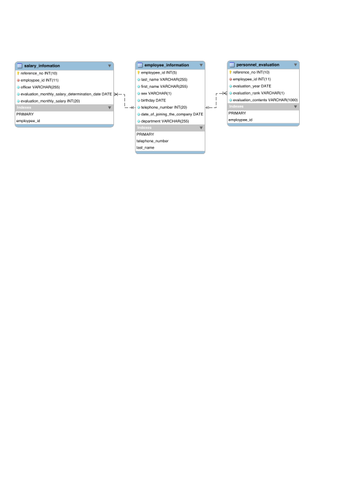

# データベース構築演習

データベース構築上のSQLノウハウを活用したケーススタディ演習を実施します。

## データベースの構築

### 仮想シナリオ

#### 人事情報システム要件

- 社員情報を登録する・管理する
- 年次評価情報を管理する
- 給与情報を管理する

#### 必要なデータを考える

- 社員データ
- 評価データ
- 給与データ

#### 細かいデータ項目を設定する

- 社員データ
    - 社員ID
    - 姓
    - 名
    - 性別
    - 入社年月日

#### ER図に落とし込む


#### その他

- 全ての項目にNOT NULL
- 外部キーは親テーブルが変更されたら、子テーブルにも反映されるように設定する


## 挿入データの日本語化

登録するデータを日本語化する場合は、

```mysql
CREATE TABLE evaluations ( .... ) ENGINE=InnoDB DEFAULT CHARSET=utf8mb4;

```

## 人事情報データベースの作成

```mysql
mysql> CREATE DATABASE personnel_infomation;
ERROR 2013 (HY000): Lost connection to MySQL server during query
No connection. Trying to reconnect...
Connection id:    941
Current database: orders

Query OK, 1 row affected (0.14 sec)

mysql> show databases;
+----------------------+
| Database             |
+----------------------+
| information_schema   |
| innodb               |
| mysql                |
| performance_schema   |
| personnel_infomation |
| sys                  |
+----------------------+
7 rows in set (0.01 sec)


```

## 社員情報テーブルの作成


```mysql
mysql> use personnel_infomation;
Database changed

mysql> CREATE TABLE employee_information(
    -> employpee_id INT(5),
    -> last_name VARCHAR(255) NOT NULL,
    -> first_name VARCHAR(255) NOT NULL,
    -> sex VARCHAR(1) NOT NULL,
    -> birthday DATE NOT NULL,
    -> telephone_number INT(20) NOT NULL,
    -> date_of_joining_the_company DATE NOT NULL,
    -> department VARCHAR(255) DEFAULT 'unassigned' NOT NULL,
    ->     PRIMARY KEY(employpee_id),
    ->     INDEX(last_name),
    ->     UNIQUE kEY(telephone_number)
    -> ) ENGINE=InnoDB DEFAULT CHARSET=utf8mb4;
Query OK, 0 rows affected (0.03 sec)

mysql> DESC employee_information;
+-----------------------------+--------------+------+-----+------------+-------+
| Field                       | Type         | Null | Key | Default    | Extra |
+-----------------------------+--------------+------+-----+------------+-------+
| employpee_id                | int(5)       | NO   | PRI | NULL       |       |
| last_name                   | varchar(255) | NO   | MUL | NULL       |       |
| first_name                  | varchar(255) | NO   |     | NULL       |       |
| sex                         | varchar(1)   | NO   |     | NULL       |       |
| birthday                    | date         | NO   |     | NULL       |       |
| telephone_number            | int(20)      | NO   | UNI | NULL       |       |
| date_of_joining_the_company | date         | NO   |     | NULL       |       |
| department                  | varchar(255) | NO   |     | unassigned |       |
+-----------------------------+--------------+------+-----+------------+-------+
8 rows in set (0.01 sec)

mysql> show index from employee_information;
+----------------------+------------+------------------+--------------+------------------+-----------+-------------+----------+--------+------+------------+---------+---------------+
| Table                | Non_unique | Key_name         | Seq_in_index | Column_name      | Collation | Cardinality | Sub_part | Packed | Null | Index_type | Comment | Index_comment |
+----------------------+------------+------------------+--------------+------------------+-----------+-------------+----------+--------+------+------------+---------+---------------+
| employee_information |          0 | PRIMARY          |            1 | employpee_id     | A         |           0 |     NULL | NULL   |      | BTREE      |         |               |
| employee_information |          0 | telephone_number |            1 | telephone_number | A         |           0 |     NULL | NULL   |      | BTREE      |         |               |
| employee_information |          1 | last_name        |            1 | last_name        | A         |           0 |     NULL | NULL   |      | BTREE      |         |               |
+----------------------+------------+------------------+--------------+------------------+-----------+-------------+----------+--------+------+------------+---------+---------------+
3 rows in set (0.01 sec)

```


## 人事評価テーブルの作成

```mysql
mysql> use personnel_infomation;
Database changed

mysql> CREATE TABLE personnel_evaluation(
    -> reference_no INT(10) AUTO_INCREMENT,
    -> employpee_id INT NOT NULL,
    -> evaluation_year DATE NOT NULL,
    -> evaluation_rank VARCHAR(1) NOT NULL,
    -> evaluation_contents VARCHAR(1000) NOT NULL,
    ->     PRIMARY KEY(reference_no),
    ->     FOREIGN KEY (employpee_id) REFERENCES employee_information(employpee_id) ON DELETE CASCADE
    -> ) ENGINE=InnoDB DEFAULT CHARSET=utf8mb4;
Query OK, 0 rows affected (0.03 sec)

mysql> DESC personnel_evaluation;
+---------------------+---------------+------+-----+---------+----------------+
| Field               | Type          | Null | Key | Default | Extra          |
+---------------------+---------------+------+-----+---------+----------------+
| reference_no        | int(10)       | NO   | PRI | NULL    | auto_increment |
| employpee_id        | int(11)       | NO   | MUL | NULL    |                |
| evaluation_year     | date          | NO   |     | NULL    |                |
| evaluation_rank     | varchar(1)    | NO   |     | NULL    |                |
| evaluation_contents | varchar(1000) | NO   |     | NULL    |                |
+---------------------+---------------+------+-----+---------+----------------+
5 rows in set (0.01 sec)


```


## 給与情報テーブルの作成


```mysql
mysql> use personnel_infomation;
Database changed

mysql> CREATE TABLE salary_infomation(
    -> reference_no INT(10) AUTO_INCREMENT,
    ->     employpee_id INT NOT NULL,
    ->     officer VARCHAR(255) NOT NULL, 
    -> evaluation_monthly_salary_determination_date DATE NOT NULL,
    -> evaluation_monthly_salary INT(20) NOT NULL,
    ->     PRIMARY KEY(reference_no),
    ->     FOREIGN KEY (employpee_id) REFERENCES employee_information(employpee_id) ON DELETE CASCADE
    -> ) ENGINE=InnoDB DEFAULT CHARSET=utf8mb4;
Query OK, 0 rows affected (0.03 sec)

mysql> DESC salary_infomation;
+----------------------------------------------+--------------+------+-----+---------+----------------+
| Field                                        | Type         | Null | Key | Default | Extra          |
+----------------------------------------------+--------------+------+-----+---------+----------------+
| reference_no                                 | int(10)      | NO   | PRI | NULL    | auto_increment |
| employpee_id                                 | int(11)      | NO   | MUL | NULL    |                |
| officer                                      | varchar(255) | NO   |     | NULL    |                |
| evaluation_monthly_salary_determination_date | date         | NO   |     | NULL    |                |
| evaluation_monthly_salary                    | int(20)      | NO   |     | NULL    |                |
+----------------------------------------------+--------------+------+-----+---------+----------------+
5 rows in set (0.01 sec)

```


## MySQL Workbench で生成したRE図




## データの挿入

### 社員情報テーブル
```mysql

mysql> INSERT INTO employee_information VALUES
    -> (1001,'佐藤','隆','m','060-9783-0193',20180401,19750808,'営業'),
    -> (1002,'遠藤','真紀','w','060-8503-1284',20160401,19740808,'人事'),
    -> (1003,'工藤','孝明','m','060-9874-6382',20100401,19720909,'開発');
Query OK, 3 rows affected, 3 warnings (0.02 sec)
Records: 3  Duplicates: 0  Warnings: 3

mysql> SELECT * FROM employee_information;
+--------------+-----------+------------+-----+------------+------------------+-----------------------------+------------+
| employpee_id | last_name | first_name | sex | birthday   | telephone_number | date_of_joining_the_company | department |
+--------------+-----------+------------+-----+------------+------------------+-----------------------------+------------+
|         1001 | 佐藤      | 隆         | m   | 0000-00-00 |         20180401 | 1975-08-08                  | 営業       |
|         1002 | 遠藤      | 真紀       | w   | 0000-00-00 |         20160401 | 1974-08-08                  | 人事       |
|         1003 | 工藤      | 孝明       | m   | 0000-00-00 |         20100401 | 1972-09-09                  | 開発       |
+--------------+-----------+------------+-----+------------+------------------+-----------------------------+------------+


```


### 人事評価テーブル

```mysql
mysql> INSERT INTO personnel_evaluation(employpee_id, evaluation_year, evaluation_rank, evaluation_contents) VALUES
    -> (1001,2019, 'A','非常に優秀でした。'),
    -> (1002,2019, 'B','良かったです。'),
    -> (1003,2019, 'E','今後の改善が必要です。');
Query OK, 3 rows affected, 3 warnings (0.01 sec)
Records: 3  Duplicates: 0  Warnings: 3

mysql> SELECT * FROM personnel_evaluation;
+--------------+--------------+-----------------+-----------------+-----------------------------------+
| reference_no | employpee_id | evaluation_year | evaluation_rank | evaluation_contents               |
+--------------+--------------+-----------------+-----------------+-----------------------------------+
|            1 |         1001 | 0000-00-00      | A               | 非常に優秀でした。                |
|            2 |         1002 | 0000-00-00      | B               | 良かったです。                    |
|            3 |         1003 | 0000-00-00      | E               | 今後の改善が必要です。            |
+--------------+--------------+-----------------+-----------------+-----------------------------------+
3 rows in set (0.01 sec)


```


### 給与情報テーブル

```mysql
mysql> INSERT INTO salary_infomation                                                                                                                                                                     -> (employpee_id, officer, evaluation_monthly_salary_determination_date, evaluation_monthly_salary)
    -> VALUES
    -> (1001,'営業担当',20190301,200000),
    -> (1002,'リーダー',20190301,250000),
    -> (1003,'係長',20190301,300000);
Query OK, 3 rows affected (0.01 sec)
Records: 3  Duplicates: 0  Warnings: 0

mysql> SELECT * FROM salary_infomation;
+--------------+--------------+--------------+----------------------------------------------+---------------------------+
| reference_no | employpee_id | officer      | evaluation_monthly_salary_determination_date | evaluation_monthly_salary |
+--------------+--------------+--------------+----------------------------------------------+---------------------------+
|            1 |         1001 | 営業担当     | 2019-03-01                                   |                    200000 |
|            2 |         1002 | リーダー     | 2019-03-01                                   |                    250000 |
|            3 |         1003 | 係長         | 2019-03-01                                   |                    300000 |
+--------------+--------------+--------------+----------------------------------------------+---------------------------+
3 rows in set (0.01 sec)

```